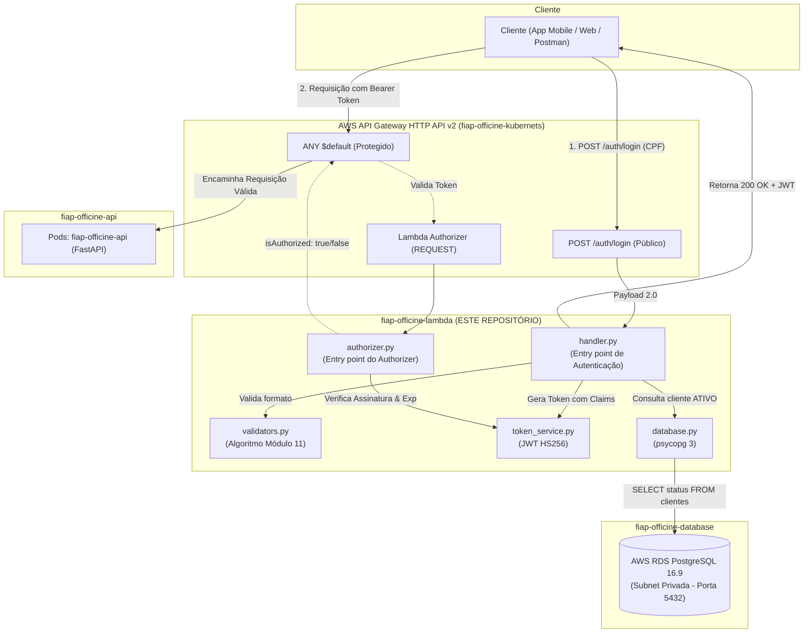

# ⚡ fiap-officine-lambda — Function Serverless de Autenticação (AWS Lambda)

**Tech Challenge FIAP (15SOAT)**  
Repositório responsável pela **Function Serverless (AWS Lambda)** e pelo **Lambda Authorizer** do ecossistema **fiap-officine**. Provê autenticação centralizada, validação matemática de CPF, consulta de integridade no banco gerenciado e assinatura criptográfica de tokens JWT.

---

## 🎯 Propósito do Repositório

Esta função serverless provê o serviço desacoplado e escalável de identificação e autorização de clientes:
1. **Validar o CPF do cliente**: Aplicação rigorosa do algoritmo oficial dos dígitos verificadores (módulo 11 da Receita Federal) e rejeição imediata de sequências repetidas.
2. **Consultar existência e status do cliente**: Conexão privada com o banco de dados **AWS RDS PostgreSQL** (gerenciado no repositório `fiap-officine-database`) para verificar se o cliente existe e possui status `ATIVO`.
3. **Gerar e devolver token JWT**: Assinatura criptográfica do token de acesso contendo os claims necessários (`sub`, `role: cliente`, `cliente_id`, `nome`) para consumo seguro das APIs da oficina.
4. **Lambda Authorizer**: Interceptador de requisições no **AWS API Gateway HTTP API v2** (provisionado no repositório `fiap-officine-kubernets`), validando a assinatura do token antes de rotear o tráfego para os pods do Kubernetes.

---

## 🏗️ Diagrama da Arquitetura do Repositório



---

## 🚀 Tecnologias Utilizadas

| Tecnologia | Uso |
| :--- | :--- |
| **Python 3.12** | Runtime oficial e moderno da AWS Lambda com suporte a tipagem estática |
| **uv** | Gerenciador de pacotes e ambientes virtuais ultrarrápido em Rust |
| **psycopg 3 (`psycopg[binary]`)** | Driver PostgreSQL nativo de alta performance para execução serverless |
| **python-jose** | Geração, assinatura e decodificação de tokens JWT |
| **pytest & pytest-cov** | Testes automatizados unitários com cobertura de código |
| **Terraform 1.9+** | Infraestrutura como Código (IaC) para empacotamento zip, Lambda, IAM Roles e CloudWatch |
| **GitHub Actions** | Pipeline de CI/CD para lint, testes e deploy automatizado na AWS |

---

## 📡 Documentação das APIs (Swagger & Postman)

A documentação interativa e os contratos de autenticação podem ser acessados via API Gateway:

* **Endpoint Ativo de Login**:  
  👉 `POST https://kai652jumh.execute-api.sa-east-1.amazonaws.com/auth/login`
* **Swagger UI Geral das APIs**:  
  👉 [https://kai652jumh.execute-api.sa-east-1.amazonaws.com/docs](https://kai652jumh.execute-api.sa-east-1.amazonaws.com/docs)
* **OpenAPI Specification (JSON)**:  
  👉 [https://kai652jumh.execute-api.sa-east-1.amazonaws.com/openapi.json](https://kai652jumh.execute-api.sa-east-1.amazonaws.com/openapi.json)

### 🔐 Comportamento de Acesso e Códigos de Retorno das Rotas

| Tipo de Rota | Endpoints | Autorização | Comportamento e Resposta |
| :--- | :--- | :--- | :--- |
| **Autenticação** | `POST /auth/login` | Nenhuma (Valida CPF no RDS) | `200 OK` contendo o `access_token` JWT emitido por esta Lambda |
| **Protegidas** | `/api/v1/ordens-servico/*`, etc. | **Bearer JWT Obrigatório** | • **Sem Token ou Inválido**: `401 Unauthorized` (bloqueado pelo **Lambda Authorizer** de borda)<br>• **Com Token Válido**: `200 OK` / `201 Created` encaminhado aos pods do Kubernetes |
| **Públicas** | `/health`, `/docs`, `/openapi.json` | Nenhuma (`NONE`) | `200 OK` (retorna `503 Service Unavailable` apenas durante eventuais reinicializações/cold start do nó EC2 Free Tier) |

### Exemplo de Requisição no Postman / Curl:
```bash
curl -X POST https://kai652jumh.execute-api.sa-east-1.amazonaws.com/auth/login \
  -H "Content-Type: application/json" \
  -d '{"cpf": "52998224725"}'
```

**Resposta HTTP 200 OK:**
```json
{
  "access_token": "eyJhbGciOiJIUzI1NiIsInR5cCI6IkpXVCJ9...",
  "token_type": "bearer",
  "expires_in": 7200,
  "cliente": {
    "id": "1",
    "nome": "Carlos Eduardo Ferreira",
    "cpf": "52998224725",
    "status": "ATIVO"
  }
}
```

---

## 🛠️ Como Executar e Testar Localmente

### Pré-requisitos
* [Python 3.12+](https://www.python.org/)
* [uv](https://docs.astral.sh/uv/) instalado (`pip install uv` ou `curl -LsSf https://astral.sh/uv/install.sh | sh`)

### Instalação das Dependências
```bash
uv sync
```

### Execução dos Testes Automatizados
```bash
# Executa todos os testes unitários (validadores, handler e authorizer)
uv run pytest -v

# Executa checagem de estilo com Ruff
uv run ruff check .
```

---

## 🚢 Passos para Deploy

### Opção A: Deploy Automático via CI/CD (GitHub Actions)
O repositório possui pipelines configuradas em `.github/workflows/`:
* **Push/Merge em `develop`**: Executa testes e realiza deploy contínuo em **Homologação** (AWS `sa-east-1`).
* **Push/Merge em `main`**: Executa testes e realiza deploy contínuo em **Produção**.

### Opção B: Deploy Manual com Terraform
```bash
cd terraform

# Inicializar o Terraform
terraform init

# Visualizar o plano de execução
terraform plan -var-file="terraform.tfvars"

# Aplicar e provisionar a Lambda na AWS
terraform apply -var-file="terraform.tfvars" -auto-approve
```

---

## ⚙️ Variáveis de Ambiente da Lambda

| Variável | Descrição | Exemplo |
| :--- | :--- | :--- |
| `DB_HOST` | Endpoint do AWS RDS PostgreSQL | `fiap-officine-homolog-rds.chmmasky8j6y.sa-east-1.rds.amazonaws.com` |
| `DB_PORT` | Porta de conexão do banco | `5432` |
| `DB_NAME` | Nome da base de dados | `officine_db` |
| `DB_USER` | Usuário administrador | `dbadmin` |
| `DB_PASSWORD` | Senha segura armazenada no Secrets Manager | `********` |
| `JWT_SECRET_KEY` | Chave secreta de assinatura do token JWT | `********` |
| `JWT_ALGORITHM` | Algoritmo criptográfico de assinatura | `HS256` |
| `JWT_ACCESS_TOKEN_EXPIRE_MINUTES` | Duração da validade do token | `120` |

---

## 🔒 Governança de Branches
* **Branch `main` e `develop` protegidas** contra commits diretos.
* **Pull Requests obrigatórios** com validação de linters e testes unitários.
